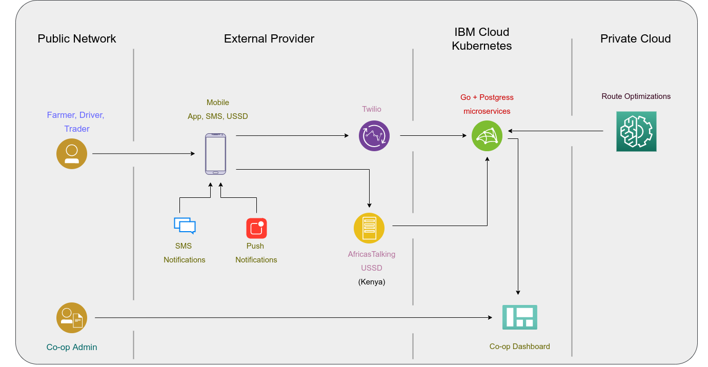

# IBM-Call-for-code-2021-zero-hunger-solution: Mavuno

## Contents
1. 

## Short Description
It's an platform that connects farmers to buyers and consumers.

## What's the problem?
From a research conducted by the Food and Agriculture Organisation (FAO) and the United States Agency for International Development (USAID) in 2020, Kenya loses 30 percent of food produced after harvest.Of this, about 20 percent of the food is lost at the farm level, while 60 per cent (of what remains) is lost at the marketing stage. Reducing these losses is the objective of Mavuno Link.

## The idea
Mavuno Link has an app, ussd and sms platform that connects farmers and traders. With this platform, farmers will be able to connect with traders directly hence eliminating middlemen who often short change the farmers. Additionally, the platform will fasten the trade process thus resulting in greater profits and this will economically empower farmers.

## Functioning
The application has a farmer interface, a driver interface and a consumer interface. The whole process is controlled by a co-op admin. Through the app the farmer will make it known that he/she has a certain amount of a particular produce. The farmer also selects the pickup location. The trader will then input the goods he/she needs and the quantity too. Twilio relays data from the sms and whatsapp platforms to the backend. IBM cloud Kubernetes was used as our microservices platform. The co-op admin links the farmer to the relevant trader. Route optimization is done with the aid of machine learning. This will ensure that the goods get from the farmer to the trader in the shortest possible time which means that a lot less of farm produce is ever spoilt. 

A lot of technological solutions tend to require good internet connectivity and average to high level of user computer literacy. However, Mavuno Link’s WhatsApp, USSD and SMS functionalities ensure that the app’s benefits can be ripped by farmers regardless of their bandwidth of internet connectivity and computer literacy hence broadening the number of farmers that can be part of Mavuno Link. 

## Solution
Scalability plan. We expect to onboard other users in addition to traders and farmers who can come together, pull resources and order food produce directly from the farmers. This will reduce food wastage tha occurs as goods await purchase in the market and increase savings. Eventually, with the data collected we will provide accurate predictions to farmers on our platform on the types of crops to grow during a given period of the year.

## Video

## Architecture 

1. Steps..

### IBM Cloud services used
- IBM Cloud Kubernetes Service
- IBM Watson Assistant: Intelligent virtual agent
## Walkthrough

## Contributing

## Authors
- [Sammy Kerata Oina](https://www.linkedin.com/in/sammy-oina-b1774110b/)
- [Smith Jilks](https://www.linkedin.com/in/jilks-smith-56ba74173/)
- [Rodney Osodo](https://www.linkedin.com/in/rodneyosodo/)
- [Washington Kamadi](https://www.linkedin.com/in/washingtonkk/)
- [Felix Wanyoike]( https://www.linkedin.com/in/felix-gateru-72a110149/)

Made with [contributors-img](https://contrib.rocks).
